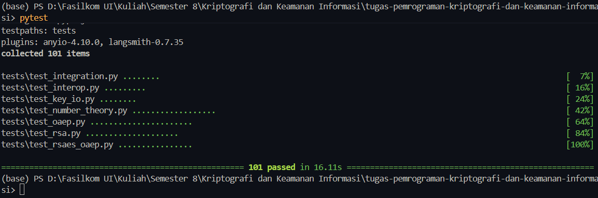

# RSA-OAEP-256

Tugas pemrograman mata kuliah Kriptografi dan Keamanan Informasi Semester Genap 2025/2026.

**Group 15**
1. Ratu Nadya Anjania (2206029752)
2. Wahyu Hidayat (2206081894)

## Deskripsi

Implementasi skema enkripsi dan dekripsi **RSA-OAEP-256** dengan kunci
**2048-bit** dalam Python, mengikuti RFC 8017 ("PKCS #1 v2.2"). Bagian RSA
dan OAEP-nya dibangun dari nol tanpa library kripto pihak ketiga.

Runtime hanya menggunakan Python standard library. SHA-256 diambil dari `hashlib`,
RNG dari `secrets` dan `os.urandom`, dan modular exponentiation dari `pow()`.

## Struktur

```
src/rsa_oaep/
├── number_theory.py    # Miller-Rabin, prime gen, modinv, egcd
├── rsa.py              # RSA keygen, RSAEP/RSADP, I2OSP/OS2IP
├── oaep.py             # MGF1-SHA256, EME-OAEP encode/decode
├── rsaes_oaep.py       # Top-level encrypt dan decrypt, chunking otomatis
└── key_io.py           # Save/load kunci dalam format hex

tests/
├── test_number_theory.py
├── test_rsa.py
├── test_oaep.py
├── test_rsaes_oaep.py
├── test_key_io.py
├── test_integration.py
└── test_interop.py
```

## Modul

| Modul | Fungsi |
|-------|----------------|
| `number_theory` | Primality test (Miller-Rabin), prime generation 1024-bit, extended Euclidean, modular inverse |
| `rsa` | Key generation 2048-bit, primitif RSAEP dan RSADP, I2OSP dan OS2IP |
| `oaep` | MGF1 dengan SHA-256, EME-OAEP encode dan decode |
| `rsaes_oaep` | API utama `encrypt(bytes, pub) -> bytes` dan `decrypt(bytes, priv) -> bytes`, dengan chunking otomatis untuk plaintext panjang |
| `key_io` | Save dan load kunci ke file teks hex |

## Penggunaan

```python
from rsa_oaep.rsa import generate_keypair
from rsa_oaep.rsaes_oaep import encrypt, decrypt
from rsa_oaep.key_io import (
    save_public_key, load_public_key,
    save_private_key, load_private_key,
)

# Generate keypair 2048-bit
pub, priv = generate_keypair(bits=2048)

# Simpan ke disk (format hex)
save_public_key(pub, "rsa.pub")
save_private_key(priv, "rsa.priv")

# Enkripsi dan dekripsi. Input dan output berupa bytes, bisa file biner apa saja.
ciphertext = encrypt(b"hello world", pub)
plaintext  = decrypt(ciphertext, priv)
assert plaintext == b"hello world"
```

## Format File Kunci

Kunci disimpan sebagai teks plain ASCII dengan nilai hexadecimal lowercase.

```
<modulus n dalam hex (lowercase, padded ke 512 char untuk 2048-bit)>
<exponent e (untuk public) atau d (untuk private), hex natural width>
```

- `*.pub` -> 2 baris, `n_hex` lalu `e_hex` (umumnya `10001` = 65537)
- `*.priv` -> 2 baris, `n_hex` lalu `d_hex`

## Chunking Plaintext

OAEP-SHA256 dengan modulus 2048-bit menampung maksimum **190 byte** plaintext
per blok (`k - 2*hLen - 2 = 256 - 64 - 2`). Plaintext yang lebih panjang
dipecah otomatis jadi beberapa blok, masing-masing menghasilkan ciphertext
256 byte yang digabung berurutan. Dekripsi membalik proses ini per blok.

## Setup dan Test

```powershell
pip install -r requirements.txt
pytest -v
```

### Hasil Test



| Modul | Test | Coverage |
|-------|------|----------|
| `test_number_theory` | 18 | Known primes/composites, Carmichael numbers, Mersenne prime, generate_prime bit-length |
| `test_rsa` | 20 | I2OSP/OS2IP roundtrip, keygen 2048-bit, RSAEP/RSADP boundary cases |
| `test_oaep` | 22 | MGF1 determinism, EME-OAEP roundtrip, decode error cases |
| `test_rsaes_oaep` | 16 | Roundtrip 0/1/189/190/191/1024/50KB byte, byte patterns (zeros, FFs), block boundaries |
| `test_key_io` | 9 | Hex format roundtrip, malformed file detection |
| `test_integration` | 7 | End-to-end disk I/O dengan berbagai ukuran (5B/1KB/10KB) |
| `test_interop` | 9 | Cross-validation 2 arah dengan library `cryptography` sebagai referensi |

`test_interop` melakukan cross-validation dua arah dengan library
`cryptography` sebagai test-only dependency. Ciphertext dari implementasi
ini didekripsi oleh library referensi, dan sebaliknya. Test ini akan gagal
bila format OAEP atau MGF1 menyimpang dari RFC 8017.

## Referensi

- RFC 8017, *PKCS #1: RSA Cryptography Specifications Version 2.2*.
  <https://www.rfc-editor.org/rfc/rfc8017>
